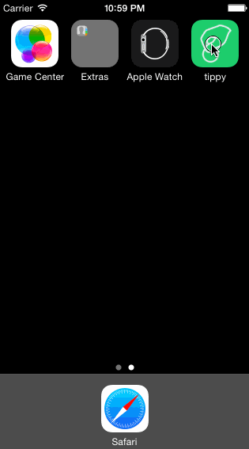

# Tippy

This is a Tip Calculator application for iOS submitted as the [pre-assignment](https://gist.github.com/timothy1ee/7747214) requirement for CodePath.

Time spent: ~7 hours

Completed:

* [Yes] Required: User can enter a bill amount, choose a tip percentage, and see the tip and total values.
* [Yes] Required: Settings page to change the default tip percentage.
* [Yes] Optional: Making sure the keyboard is always visible and the bill amount is always the first responder. This way the user doesn't have to tap anywhere to use this app. Just launch the app and start typing.
* [Yes] Optional: UI animations
* [Yes] Optional: Using locale-specific currency and currency thousands separators.
* [No] Optional: Remembering the bill amount across app restarts (if <10mins)

-----

# Instructions:

* Ever get confused how much to pay when the bill comes? Never again w/ Tippy!

## Just 3 simple steps:

1. Tell us the bill amount
2. How did you feel about the service? (Meh, Happy, OMFG?)
3. How many people are paying? (Supports up to 4 people!)

* BAM! Tippy instantly tells you how much to pay
* Auditor friend wants proof? No sweat! Easily show the details.
* Cute server = Better tips? No sweat! Just change the settings.

## Demo

 

### Notes:

My first iOS app
* I got stuck in a few areas but Apple Docs + Stackover allowed me to push through
* TLDR: I wanted to create a tip calculator that is simple and just tells you what to pay. I hope you like my interpretation!
* It was a fun assignment and nice way to explore the Swift documentation.

### If I was building this into a business: Future Feature Ideas

If this is a problem I just wanted to solve. There are many feature ideas.

* Tipping culture is different in different locations. For example in AU, it is not customary to tip. Have a geolocated feature that sets different tips based on different countries.
* Build a history of what you've paid. This can be helpful. Next time a friend asks, what's a good place to eat? You can easily make recs based on budget.
* Tie in photos and integrate it with social media + apps like Yelp. So you can remember your social eating experiences a bit more. 
* There are more complex scenarios of tipping. For example a friend invites you to dinner with his girlfriend. He will cover two people. The app can handle these use cases.
* When it comes to paying, sometimes people don't have money on hand. A history can be helpful to know who owes who what. Or it can be tied to Venmo, Stripe, etc to ensure that equal payment is met.
* Categorize meals and integrate app with finance based apps like Quickbook or expensing apps like Expensify. This way I can easily update my accountant on business expenses vs. friendly meals.
* If it is one person paying, there may be a higher likelihood it is romamtic or developing a friendship. Have quick call to action to send flowers or other things.
* After the meal is done, you might want to order a Uber or check the bus schedule. Have a quick call to check transportation options as next steps.
